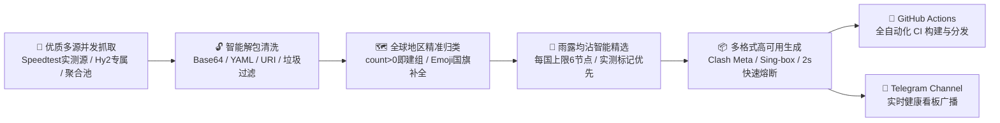

# 🚀 MetaFetch - 高性能全自动代理节点聚合与免费订阅引擎

<div align="center">

[](https://github.com/lanzm/MetaFetch/actions)
[](https://github.com/lanzm/MetaFetch/stargazers)
[](https://github.com/lanzm/MetaFetch/network/members)
[](https://www.python.org/)
[](https://t.me/MetaFetchNodes)
<!-- STATS_BADGE_START -->


<!-- STATS_BADGE_END -->
[](LICENSE)

<p align="center">
  <b>实测优质源聚合 · 雨露均沾智能精选 · 全球地区精准识别 · 秒级故障自愈切换</b>
</p>

</div>

---

## 📥 订阅链接面板

> 📢 **官方 Telegram 频道**：欢迎加入 [MetaFetch 节点发布频道 (t.me/MetaFetchNodes)](https://t.me/MetaFetchNodes) 获取最新节点状态广播与技术交流！

### 1. 🛡️ Clash / Mihomo 专用订阅 (YAML)

> 💡 适合 **Clash Verge / Mihomo Party / Clash Nyanpasu / Stash / Clash for Windows** 等客户端。

**📡 CDN 加速 (推荐)**
```
https://fastly.jsdelivr.net/gh/lanzm/MetaFetch@master/list.meta.yml
```
**🔗 GitHub 直连**
```
https://raw.githubusercontent.com/lanzm/MetaFetch/master/list.meta.yml
```

<details><summary>📱 扫码订阅 (点击二维码可放大)</summary>
<table><tr>
<td align="center"><b>CDN 加速</b><br><a href="https://api.qrserver.com/v1/create-qr-code/?size=400x400&data=https%3A%2F%2Ffastly.jsdelivr.net%2Fgh%2Flanzm%2FMetaFetch%40master%2Flist.meta.yml"></a></td>
<td align="center"><b>GitHub 直连</b><br><a href="https://api.qrserver.com/v1/create-qr-code/?size=400x400&data=https%3A%2F%2Fraw.githubusercontent.com%2Flanzm%2FMetaFetch%2Fmaster%2Flist.meta.yml"></a></td>
</tr></table>
</details>

### 2. ⚡ Sing-box 专用订阅 (JSON)

> 💡 适合 **Sing-box / Hiddify / Karing** 等 Sing-box 内核客户端。

**📡 CDN 加速 (推荐)**
```
https://fastly.jsdelivr.net/gh/lanzm/MetaFetch@master/list.singbox.json
```
**🔗 GitHub 直连**
```
https://raw.githubusercontent.com/lanzm/MetaFetch/master/list.singbox.json
```

<details><summary>📱 扫码订阅 (点击二维码可放大)</summary>
<table><tr>
<td align="center"><b>CDN 加速</b><br><a href="https://api.qrserver.com/v1/create-qr-code/?size=400x400&data=https%3A%2F%2Ffastly.jsdelivr.net%2Fgh%2Flanzm%2FMetaFetch%40master%2Flist.singbox.json"></a></td>
<td align="center"><b>GitHub 直连</b><br><a href="https://api.qrserver.com/v1/create-qr-code/?size=400x400&data=https%3A%2F%2Fraw.githubusercontent.com%2Flanzm%2FMetaFetch%2Fmaster%2Flist.singbox.json"></a></td>
</tr></table>
</details>

### 3. 📱 通用 Base64 / 节点列表订阅 (小火箭 / V2rayN)

> 💡 适合 **Shadowrocket (小火箭)**、**V2rayN**、**V2rayNG**、**Quantumult X**、**Surfboard** 等常用客户端。

**📡 Base64 订阅 (推荐)**
```
https://fastly.jsdelivr.net/gh/lanzm/MetaFetch@master/list.b64
```
**📄 明文 URL 节点列表**
```
https://fastly.jsdelivr.net/gh/lanzm/MetaFetch@master/list.txt
```

<details><summary>📱 扫码订阅 (点击二维码可放大)</summary>
<table><tr>
<td align="center"><b>Base64 订阅</b><br><a href="https://api.qrserver.com/v1/create-qr-code/?size=400x400&data=https%3A%2F%2Ffastly.jsdelivr.net%2Fgh%2Flanzm%2FMetaFetch%40master%2Flist.b64"></a></td>
<td align="center"><b>明文节点列表</b><br><a href="https://api.qrserver.com/v1/create-qr-code/?size=400x400&data=https%3A%2F%2Ffastly.jsdelivr.net%2Fgh%2Flanzm%2FMetaFetch%40master%2Flist.txt"></a></td>
</tr></table>
</details>

---

## 📋 客户端格式速查表

| 客户端 / 平台 | 推荐订阅类型 | 推荐订阅格式 | 支持协议 |
| :--- | :--- | :--- | :--- |
| **Clash Verge / Mihomo Party / Flclash** (Win / Mac / Linux) | 🛡️ Clash / Mihomo 配置 | `list.meta.yml` | VMess, VLESS, SS, Trojan, Hysteria2 |
| **Sing-box / Hiddify / Karing** (全平台) | ⚡ Sing-box 格式 | `list.singbox.json` | VMess, VLESS, SS, Trojan, Hysteria2 |
| **Shadowrocket (小火箭)** (iOS) | 📱 通用 Base64 / Clash | `list.b64` 或 `list.meta.yml` | 全部主流协议 |
| **V2rayN / V2rayNG** (Win / Android) | 📱 通用 Base64 订阅 | `list.b64` / `list.txt` | VMess, VLESS, SS, Trojan |
| **Quantumult X / Loon / Surge** (iOS / Mac) | 🛡️ Clash 订阅或 Base64 | `list.meta.yml` / `list.b64` | 常用协议 |

---

## ⚡ 1 分钟快速上手

1. **复制订阅**：根据上方的客户端速查表，复制对应的 **📡 CDN 加速** 链接。
2. **导入配置**：
   - **Clash / Mihomo / Verge**：打开客户端 → 进入「订阅 / Profiles」→ 粘贴链接并点击「保存 / 下载」。
   - **Shadowrocket (小火箭)**：打开 App → 点击右上角 `+` → 类型选择 `Subscribe` → 粘贴链接并保存。
   - **Sing-box / Hiddify**：进入配置管理 → 点击「添加订阅」→ 粘贴 JSON 格式链接。
3. **选择节点**：建议选中 **「🔰 延迟最低」** 或 **「♻️ 自动选择」** 策略组，客户端会自动测速并切换至优质可用节点。

---

## 🏗️ 架构与处理流程



---

## ✨ 核心特性

- **👑 实测高带宽优先**：重点聚合自带 Speedtest 测速验证的 `speednode` 节点与实测 `MB/s` 带宽标记节点，拒绝盲目爬取死节点。
- **🌐 雨露均沾智能精选**：对全球 30+ 独立境外地区均摊抽样（每国上限 5~6 个节点），彻底解决单一国家霸屏问题，冷门坚挺与主流低延时兼备。
- **⚡ 毫秒级自愈与国内 100% 隔离**：设置 `timeout: 2000`（2 秒熔断切走备用）与 `interval: 60`（1 分钟定期保活自愈），100% 隔离排除中国国内节点。
- **🛡️ 严格合法性过滤**：自动清洗非法/回环 Server（`0.0.0.0`, `127.0.0.1` 等），智能修正 Shadowsocks 插件参数。
- **🗺️ 全球无死角归类**：只要抓取到节点即独立建组（`count > 0`），冷门小众国家节点不再被吞没。

---

## 📊 节点分布统计

<!-- STATS_TABLE_START -->
> 更新时间：`2026-08-27 03:52:51`
> 运行分析：从 `10` 个活跃源中抓取 `1003` 个节点，耗时 `1.93s`。去重后保留 `890` 个有效节点。

<div style="overflow-x: auto;">

| 地区分布 | 🇭🇰香港 | 🇹🇼台湾 | 🇯🇵日本 | 🇺🇸美国 | 🇸🇬新加坡 | 🇰🇷韩国 | 🇩🇪德国 | 🇬🇧英国 | 🇫🇷法国 | 🇷🇺俄罗斯 | 🇨🇦加拿大 | 🇳🇱荷兰 | 🇨🇭瑞士 | 🇮🇳印度 | 🇹🇷土耳其 | 🇦🇺澳大利亚 | 🇮🇩印尼 | 🇦🇷阿根廷 | 🇲🇽墨西哥 | 🇮🇹意大利 | 🇪🇸西班牙 | 🇨🇳中国 | 🇷🇴罗马尼亚 | 🇫🇮芬兰 | 🇮🇪爱尔兰 | 🇸🇪瑞典 | 🇵🇱波兰 | 🇦🇹奥地利 | 🇦🇪阿联酋 | 🇨🇾塞浦路斯 | 🇺🇦乌克兰 | 🇳🇴挪威 | 🇧🇬保加利亚 | 🇿🇦南非 | 🌍其他 | **总计** |
| :---: | :---: | :---: | :---: | :---: | :---: | :---: | :---: | :---: | :---: | :---: | :---: | :---: | :---: | :---: | :---: | :---: | :---: | :---: | :---: | :---: | :---: | :---: | :---: | :---: | :---: | :---: | :---: | :---: | :---: | :---: | :---: | :---: | :---: | :---: | :---: | :---: |
| **数量** | 41 | 12 | 45 | 252 | 40 | 24 | 21 | 19 | 13 | 6 | 4 | 22 | 3 | 4 | 16 | 1 | 1 | 2 | 1 | 1 | 7 | 13 | 119 | 5 | 2 | 5 | 7 | 4 | 2 | 1 | 2 | 1 | 2 | 1 | 191 | **890** |

</div>
<!-- STATS_TABLE_END -->

<br/>

<!-- SOURCE_STATS_TABLE_START -->
### 📡 各订阅源贡献度明细

> 数据计算时间：`2026-08-27 03:52:49`

<table width="100%"><tr><td>

<div style="max-height: 260px; overflow-y: auto;">

| 排名 | 订阅源名称 | 有效节点数 | 节点贡献占比 |
| :---: | :--- | :---: | :---: |
| 1 | `🔥🔥🔥 w1770946466 长期订阅` | **550** 个 | `55.56%` |
| 2 | `📡 Zhangkai 系列 (speednodes)` | **144** 个 | `14.55%` |
| 3 | `[长效备份] hysteria2 节点` | **68** 个 | `6.87%` |
| 4 | `[长效备份] hy2 节点` | **58** 个 | `5.86%` |
| 5 | `⚡ Misaka Chromego 聚合池` | **43** 个 | `4.34%` |
| 6 | `📡 Huibq 聚合` | **43** 个 | `4.34%` |
| 7 | `📡 shaoyouvip 每日更新` | **43** 个 | `4.34%` |
| 8 | `📱 Pawdroid 免费节点库` | **20** 个 | `2.02%` |
| 9 | `🔥🔥🔥 日抛机场系列` | **14** 个 | `1.41%` |
| 10 | `我的私密机场 1` | **7** 个 | `0.71%` |
| **-** | **总计 (包含跨源重合)** | **990** 个 | `100.00%` |

</div>

</td></tr></table>
<!-- SOURCE_STATS_TABLE_END -->

---

## 🚀 私有化部署与 Fork 指南

如果你想拥有专属的私有订阅源聚合池，可以轻松 Fork 本项目免费部署在 GitHub Actions 上：

1. **Fork 本仓库**：点击右上角 `Fork` 到个人账号下。
2. **配置私密源 (可选)**：进入仓库 `Settings` → `Secrets and variables` → `Actions`，添加 `PRIVATE_SOURCES`（支持填入每行一个私密订阅链接）。
3. **开启 Actions**：在 `Actions` 标签页中点击 `I understand my workflows, go ahead and enable them` 激活自动每 3 小时定时抓取。
4. **本地运行**：
   ```bash
   git clone --depth=1 https://github.com/lanzm/MetaFetch.git
   cd MetaFetch
   pip install -r requirements.txt
   python main.py
   ```

---

## ❓ 常见问题 (FAQ)

<details>
<summary><b>Q1: 为什么现在的「♻️ 自动选择」测速快且连通率高？</b></summary>
<p>本项目采用了<b>「雨露均沾智能精选算法」</b>，从全球 30+ 独立境外地区中精选约 80~130 个带 <code>speednode</code> 和 <code>MB/s</code> 测速标记的优质节点，不再让客户端同时轮询几千个死节点，测速毫秒级完成，杜绝卡顿与发热。</p>
</details>

<details>
<summary><b>Q2: 为什么「自动选择」里会有罗马尼亚、芬兰等冷门国家？</b></summary>
<p>主流地区（港日美）在晚高峰或封锁期容易拥堵，而冷门小众国家（如罗马尼亚、芬兰、荷兰等）由于使用人数极少，带宽充足且极少受到 GFW 干扰，稳定性极其出色。多国均摊能确保在主流地区波动时秒级平滑接盘。</p>
</details>

<details>
<summary><b>Q3: CDN 加速链接与 GitHub 直连链接有什么区别？</b></summary>
<p><b>CDN 加速链接</b>（jsDelivr）在国内网络环境下下载更快更稳，但通常存在几分钟的边缘缓存；<b>GitHub 直连链接</b>保证秒级最新数据，但在部分网络环境下需要梯子环境访问。</p>
</details>

<details>
<summary><b>Q4: 免费节点安全吗？可以用来登录个人账号吗？</b></summary>
<p><b>严禁</b>使用任何公开免费代理节点登录网上银行、支付软件、个人邮箱等涉及重要隐私的账号！公开节点仅供学术研究、资料检索与开发调试使用。</p>
</details>

---

## 📈 Star 历史趋势

[](https://star-history.com/#lanzm/MetaFetch&Date)

---

## ⚠️ 免责声明

1. **仅供学习与交流使用**：本项目（包括所有相关代码、脚本及文档）仅供进行计算机网络测试、学术交流及科研学习之最终目的。
2. **不对资源的安全性负责**：本项目提供的所有节点数据均系按照自动化程序爬取自互联网公开渠道。**开发者对任何节点的安全性、可用性、隐私性或网速不提供任何担保**。
3. **数据隐私风险提示**：强烈建议使用者**切莫**使用本项目的代理环境进行涉及网银、个人隐私、敏感信息的账户操作！
4. **法律与合规指引**：使用者在获取或使用本项目等内容时，必须严格遵守当地的所有适用法律法规。任何因非法滥用本项目工具/节点所引发的一切违法违规行为及相关法律后果，均由使用者本人自行全部承担。开发者不负任何连带责任。
5. **严禁商业用途**：项目代码属于完全免费的开源代码，作者从未授权任何个人和组织将本项目的产出或代码用于任何商业牟利行为。

---
*Generated & Updated Automatically by **MetaFetch Engine***
