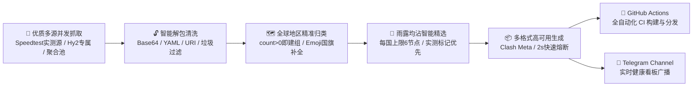

# 🚀 MetaFetch - 高性能全自动代理节点聚合与免费订阅引擎

<div align="center">

[](https://github.com/lanzm/MetaFetch/actions)
[](https://github.com/lanzm/MetaFetch/stargazers)
[](https://github.com/lanzm/MetaFetch/network/members)
[](https://www.python.org/)
[](https://t.me/MetaFetchNodes)
<!-- STATS_BADGE_START -->


<!-- STATS_BADGE_END -->
[](LICENSE)

<p align="center">
  <b>实测优质源聚合 · 雨露均沾智能精选 · 全球地区精准识别 · 秒级故障自愈切换</b>
</p>

</div>

---

## 📥 订阅链接面板

> 📢 **官方 Telegram 频道**：欢迎加入 [MetaFetch 节点发布频道 (t.me/MetaFetchNodes)](https://t.me/MetaFetchNodes) 获取最新节点状态广播与技术交流！

| 客户端类别 | 适用客户端推荐 | 订阅链接 (点击直接复制) |
| :--- | :--- | :--- |
| **🛡️ Clash / Mihomo<br>*(推荐·含完整分流)*** | **Clash Verge Rev** / **Mihomo Party**<br>**FlClash** / **Stash** / **Clash Nyanpasu** | 📡 **CDN 加速 (推荐)：**<br>`https://fastly.jsdelivr.net/gh/lanzm/MetaFetch@master/list.meta.yml`<br>🔗 **备用直连：**<br>`https://raw.githubusercontent.com/lanzm/MetaFetch/master/list.meta.yml` |
| **📱 通用 Base64** | **Shadowrocket (小火箭)** / **V2rayN**<br>**V2rayNG** / **Quantumult X** / **Surfboard** | 📡 **CDN 加速 (推荐)：**<br>`https://fastly.jsdelivr.net/gh/lanzm/MetaFetch@master/list.b64`<br>🔗 **备用直连：**<br>`https://raw.githubusercontent.com/lanzm/MetaFetch/master/list.b64` |
| **📄 明文节点列表** | 适合自建订阅转换、Sub-Store 抓取等高级玩法 | 📡 **CDN 加速 (推荐)：**<br>`https://fastly.jsdelivr.net/gh/lanzm/MetaFetch@master/list.txt`<br>🔗 **备用直连：**<br>`https://raw.githubusercontent.com/lanzm/MetaFetch/master/list.txt` |

<details>
<summary><b>📱 点击展开：手机端扫码快速导入二维码</b></summary>
<br>

| 🛡️ Clash / Mihomo 专用订阅 | 📱 通用 Base64 订阅 | 📄 明文 URL 节点列表 |
| :---: | :---: | :---: |
| <a href="https://api.qrserver.com/v1/create-qr-code/?size=400x400&data=https%3A%2F%2Ffastly.jsdelivr.net%2Fgh%2Flanzm%2FMetaFetch%40master%2Flist.meta.yml"></a><br><sub>(适用于手机端 Clash / FlClash 等)</sub> | <a href="https://api.qrserver.com/v1/create-qr-code/?size=400x400&data=https%3A%2F%2Ffastly.jsdelivr.net%2Fgh%2Flanzm%2FMetaFetch%40master%2Flist.b64"></a><br><sub>(适用于小火箭 Shadowrocket / V2rayNG)</sub> | <a href="https://api.qrserver.com/v1/create-qr-code/?size=400x400&data=https%3A%2F%2Ffastly.jsdelivr.net%2Fgh%2Flanzm%2FMetaFetch%40master%2Flist.txt"></a><br><sub>(明文 URL 直链)</sub> |

</details>

---

## ⚡ 1 分钟快速上手

> 💡 **核心三步**：① 复制上方订阅链接 → ② 粘贴导入客户端 → ③ 策略组选择「♻️ 自动选择」并开启系统代理。

<details open>
<summary><b>🖥️ Windows / macOS（以 Clash Verge Rev / Mihomo Party 为例 · 推荐首选）</b></summary>

1. **准备客户端**：安装并启动 [Clash Verge Rev](https://github.com/clash-verge-rev/clash-verge-rev/releases) 或 [Mihomo Party](https://github.com/mihomo-party-org/mihomo-party/releases)。
2. **导入订阅**：
   - 点击左侧菜单栏的 **「订阅 (Profiles)」**。
   - 在顶部输入框粘贴 `list.meta.yml` 的 **CDN 加速链接**，点击右侧 **「导入 (Import)」**。
   - 导入成功后，**单击激活**刚才添加的配置卡片（卡片亮起或打勾即代表生效）。
3. **选择节点与开启代理**：
   - 点击左侧 **「代理 (Proxies)」**，推荐勾选 **「♻️ 自动选择」** 或 **「🔰 延迟最低」** 策略组。
   - 点击左侧 **「设置 (Settings)」**，打开 **「系统代理 (System Proxy)」** 开关，即可畅快上网。

</details>

<details>
<summary><b>📱 Android 安卓（以 FlClash / Clash Meta 为例）</b></summary>

1. **准备客户端**：安装 [FlClash](https://github.com/chen08209/FlClash/releases)（极简轻量推荐）或 [Clash Meta for Android](https://github.com/MetaCubeX/ClashMetaForAndroid/releases)。
2. **导入订阅**：
   - 打开 App，点击底部 **「配置 (Profiles)」** → 点击右下角 **`+`** 号。
   - 选择 **「从 URL 导入」**，粘贴 `list.meta.yml` 链接，名称随意填写（如 `MetaFetch`），点击保存并下载。
   - 下载完成后，**点击选中**该配置作为当前使用的文件。
3. **启动连接**：
   - 返回首页，点击中央的 **「启动」** 按钮（首次使用系统会弹出 VPN 权限确认，点击“允许”）。
   - 在代理分组中选择 **「♻️ 自动选择」** 即可。

</details>

<details>
<summary><b>🍏 iOS 苹果手机（以 Shadowrocket 小火箭 为例）</b></summary>

1. **准备客户端**：在 App Store 下载 Shadowrocket（需非国区 Apple ID）或 [Karing](https://apps.apple.com/app/karing/id6472431552)（国区可用）。
2. **导入订阅**：
   - 打开小火箭，点击首页右上角 **`+`** 号。
   - **类型 (Type)**：选择 `Subscribe`。
   - **URL**：粘贴上方表格中的 **Base64 订阅链接**（或直接在小火箭首页点击左上角扫码，扫描上方折叠面板里的二维码）。
   - **备注 (Remark)**：填写 `MetaFetch`，点击右上角「完成 (Save)」。
3. **更新与启动**：
   - App 会自动拉取所有节点，建议长按订阅点击 **「按延迟测试」** 刷新节点状态。
   - 全局路由建议保持 **「配置 (Config)」**，打开顶部 **「未连接」** 开关即可。

</details>

<details>
<summary><b>🧰 通用 Base64 客户端（v2rayN / v2rayNG）</b></summary>

- **Windows (v2rayN)**：顶部点击「订阅分组」→「订阅分组设置」→「添加」→ 粘贴 `list.b64` 链接并保存 → 再次点击「订阅分组」→「更新全部订阅 (不通过代理)」。
- **Android (v2rayNG)**：点击左上角菜单栏 →「订阅分组设置」→ 点击右上角 `+` → 粘贴 `list.b64` 链接保存 → 返回主页点击右上角三点菜单 →「更新订阅」。

</details>

---

## 📊 节点分布统计

<!-- STATS_TABLE_START -->
> 更新时间：`2026-09-26 08:50:59`
> 运行分析：从 `10` 个活跃源中抓取 `1011` 个节点，耗时 `1.53s`。去重后保留 `890` 个有效节点。

<div style="overflow-x: auto;">

| 地区分布 | 🇭🇰香港 | 🇹🇼台湾 | 🇯🇵日本 | 🇺🇸美国 | 🇸🇬新加坡 | 🇰🇷韩国 | 🇩🇪德国 | 🇬🇧英国 | 🇫🇷法国 | 🇷🇺俄罗斯 | 🇨🇦加拿大 | 🇳🇱荷兰 | 🇨🇭瑞士 | 🇮🇳印度 | 🇹🇷土耳其 | 🇦🇺澳大利亚 | 🇲🇾马来西亚 | 🇧🇷巴西 | 🇦🇷阿根廷 | 🇲🇽墨西哥 | 🇮🇹意大利 | 🇪🇸西班牙 | 🇨🇳中国 | 🇷🇴罗马尼亚 | 🇫🇮芬兰 | 🇮🇪爱尔兰 | 🇸🇪瑞典 | 🇵🇱波兰 | 🇨🇿捷克 | 🇦🇹奥地利 | 🇦🇪阿联酋 | 🇨🇾塞浦路斯 | 🇺🇦乌克兰 | 🇳🇴挪威 | 🇩🇰丹麦 | 🇵🇹葡萄牙 | 🇭🇺匈牙利 | 🇧🇬保加利亚 | 🇿🇦南非 | 🌍其他 | **总计** |
| :---: | :---: | :---: | :---: | :---: | :---: | :---: | :---: | :---: | :---: | :---: | :---: | :---: | :---: | :---: | :---: | :---: | :---: | :---: | :---: | :---: | :---: | :---: | :---: | :---: | :---: | :---: | :---: | :---: | :---: | :---: | :---: | :---: | :---: | :---: | :---: | :---: | :---: | :---: | :---: | :---: | :---: |
| **数量** | 40 | 12 | 41 | 263 | 30 | 25 | 20 | 20 | 16 | 4 | 3 | 17 | 2 | 3 | 7 | 3 | 1 | 1 | 1 | 1 | 1 | 11 | 7 | 131 | 4 | 3 | 4 | 2 | 1 | 6 | 2 | 1 | 2 | 1 | 1 | 1 | 1 | 1 | 1 | 199 | **890** |

</div>
<!-- STATS_TABLE_END -->

<br/>

<!-- SOURCE_STATS_TABLE_START -->
### 📡 各订阅源贡献度明细

> 数据计算时间：`2026-09-26 08:50:58`

<table width="100%"><tr><td>

<div style="max-height: 260px; overflow-y: auto;">

| 排名 | 订阅源名称 | 有效节点数 | 节点贡献占比 |
| :---: | :--- | :---: | :---: |
| 1 | `🔥🔥🔥 w1770946466 长期订阅` | **550** 个 | `55.00%` |
| 2 | `📡 Zhangkai 系列 (speednodes)` | **144** 个 | `14.40%` |
| 3 | `📡 shaoyouvip 每日更新` | **100** 个 | `10.00%` |
| 4 | `[长效备份] hysteria2 节点` | **90** 个 | `9.00%` |
| 5 | `📡 Huibq 聚合` | **43** 个 | `4.30%` |
| 6 | `⚡ Misaka Chromego 聚合池` | **22** 个 | `2.20%` |
| 7 | `📱 Pawdroid 免费节点库` | **20** 个 | `2.00%` |
| 8 | `🔥🔥🔥 日抛机场系列` | **14** 个 | `1.40%` |
| 9 | `[长效备份] hy2 节点` | **10** 个 | `1.00%` |
| 10 | `我的私密机场 1` | **7** 个 | `0.70%` |
| **-** | **总计 (包含跨源重合)** | **1000** 个 | `100.00%` |

</div>

</td></tr></table>
<!-- SOURCE_STATS_TABLE_END -->

---

## 🚀 私有化部署与 Fork 指南

如果你想拥有专属的私有订阅源聚合池，可以轻松 Fork 本项目免费部署在 GitHub Actions 上：

1. **Fork 本仓库**：点击右上角 `Fork` 到个人账号下。
2. **配置私密源 (可选)**：进入仓库 `Settings` → `Secrets and variables` → `Actions`，添加 `PRIVATE_SOURCES`（支持填入每行一个私密订阅链接）。
3. **开启 Actions**：在 `Actions` 标签页中点击 `I understand my workflows, go ahead and enable them` 激活自动每 2 小时定时抓取。
4. **本地运行**：
   ```bash
   git clone --depth=1 https://github.com/lanzm/MetaFetch.git
   cd MetaFetch
   pip install -r requirements.txt
   python main.py
   ```

---

## 🏗️ 架构与处理流程



---

## ✨ 核心特性

- **👑 实测高带宽优先**：重点聚合自带 Speedtest 测速验证的 `speednode` 节点与实测 `MB/s` 带宽标记节点，拒绝盲目爬取死节点。
- **🌐 雨露均沾智能精选**：对全球 30+ 独立境外地区均摊抽样（每国上限 5~6 个节点），彻底解决单一国家霸屏问题，冷门坚挺与主流低延时兼备。
- **⚡ 毫秒级自愈与国内 100% 隔离**：设置 `timeout: 2000`（2 秒熔断切走备用）与 `interval: 60`（1 分钟定期保活自愈），100% 隔离排除中国国内节点。
- **🛡️ 严格合法性过滤**：自动清洗非法/回环 Server（`0.0.0.0`, `127.0.0.1` 等），智能修正 Shadowsocks 插件参数。
- **🗺️ 全球无死角归类**：只要抓取到节点即独立建组（`count > 0`），冷门小众国家节点不再被吞没。

---

## ❓ 常见问题 (FAQ)

<details>
<summary><b>Q1: 为什么现在的「♻️ 自动选择」测速快且连通率高？</b></summary>
<p>本项目采用了<b>「雨露均沾智能精选算法」</b>，从全球 30+ 独立境外地区中精选约 80~130 个带 <code>speednode</code> 和 <code>MB/s</code> 测速标记的优质节点，不再让客户端同时轮询几千个死节点，测速毫秒级完成，杜绝卡顿与发热。</p>
</details>

<details>
<summary><b>Q2: 为什么「自动选择」里会有罗马尼亚、芬兰等冷门国家？</b></summary>
<p>主流地区（港日美）在晚高峰或封锁期容易拥堵，而冷门小众国家（如罗马尼亚、芬兰、荷兰等）由于使用人数极少，带宽充足且极少受到 GFW 干扰，稳定性极其出色。多国均摊能确保在主流地区波动时秒级平滑接盘。</p>
</details>

<details>
<summary><b>Q3: CDN 加速链接与 GitHub 直连链接有什么区别？</b></summary>
<p><b>CDN 加速链接</b>（jsDelivr）在国内网络环境下下载更快更稳，但通常存在几分钟的边缘缓存；<b>GitHub 直连链接</b>保证秒级最新数据，但在部分网络环境下需要梯子环境访问。</p>
</details>

<details>
<summary><b>Q4: 免费节点安全吗？可以用来登录个人账号吗？</b></summary>
<p><b>严禁</b>使用任何公开免费代理节点登录网上银行、支付软件、个人邮箱等涉及重要隐私的账号！公开节点仅供学术研究、资料检索与开发调试使用。</p>
</details>

<details>
<summary><b>Q5: 为什么节点列表里有「📢 订阅信息」，而且提示“请勿选择”？</b></summary>
<p>该策略组是专用于展示<b>当前订阅更新时间、有效节点总数、官方 GitHub 和 Telegram 频道</b>的公告牌。组内使用的是本地安全回环地址（<code>127.0.0.1</code>）占位，<b>仅供信息展示，无法用于联网</b>。日常使用请保持选中「♻️ 自动选择」或具体的国家地区组。</p>
</details>

<details>
<summary><b>Q6: 客户端导入订阅链接提示“下载失败”或“Network Error”怎么办？</b></summary>
<p>1. 优先使用 <b>📡 CDN 加速链接</b>（jsDelivr 对国内网络直连更友好）；<br/>
2. 若当前设备完全无代理导致 CDN 受到运营商偶然干扰，可尝试切换网络（如手机热点）或换用备用直连；<br/>
3. 检查客户端是否勾选了强制校验严格 SSL 证书，或检查本机系统时间是否与北京时间同步。</p>
</details>

<details>
<summary><b>Q7: 订阅多久更新一次？客户端需要经常手动更新吗？</b></summary>
<p>本项目配置为全天自动定时抓取清洗，但受 <b>GitHub Actions 全球任务排队拥堵机制</b> 影响，实际执行间隔通常在 <b>2~4 小时不等</b>。建议在客户端（如 Clash Verge / FlClash / 小火箭）中开启<b>「自动更新订阅」</b>功能（建议设置为 120~360 分钟自动刷新），无需每次手动点更新。</p>
</details>

<details>
<summary><b>Q8: 批量测速时为什么会有部分节点显示超时（Timeout）或红字？</b></summary>
<p>1. 免费公共节点受各地上游网络波动影响，偶有单点失效属于正常现象；<br/>
2. 部分新型协议（如 <b>Hysteria2</b>）采用 UDP 传输，若你当前所处的网络环境（如部分校园网、公司内网）严格封锁了 UDP 流量，可能会导致该类节点测速超时；<br/>
3. 强烈推荐日常直接连接 <b>「♻️ 自动选择」</b> 策略组，内核会自动每 60 秒定期保活并毫秒级切走失效节点，完全无需手动逐个测速挑节点。</p>
</details>

---

## 📈 Star 历史趋势

[](https://star-history.com/#lanzm/MetaFetch&Date)

---

## ⚠️ 免责声明

1. **仅供学习与交流使用**：本项目（包括所有相关代码、脚本及文档）仅供进行计算机网络测试、学术交流及科研学习之最终目的。
2. **不对资源的安全性负责**：本项目提供的所有节点数据均系按照自动化程序爬取自互联网公开渠道。**开发者对任何节点的安全性、可用性、隐私性或网速不提供任何担保**。
3. **数据隐私风险提示**：强烈建议使用者**切莫**使用本项目的代理环境进行涉及网银、个人隐私、敏感信息的账户操作！
4. **法律与合规指引**：使用者在获取或使用本项目等内容时，必须严格遵守当地的所有适用法律法规。任何因非法滥用本项目工具/节点所引发的一切违法违规行为及相关法律后果，均由使用者本人自行全部承担。开发者不负任何连带责任。
5. **严禁商业用途**：项目代码属于完全免费的开源代码，作者从未授权任何个人和组织将本项目的产出或代码用于任何商业牟利行为。

---
*Generated & Updated Automatically by **MetaFetch Engine***
